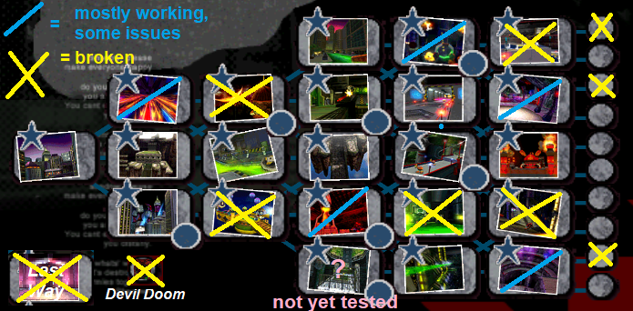

<h1>2 Player Shadow The Hedgehog</h1>

## About
This project aims to get 2 Players working in Shadow The Hedgehog (GameCube)'s 1P modes.
Story Mode, Select Mode, Expert Mode, Last Story.

## Level Status

## Release 1 (Scheduled for EOD 10.28.2018)
* To be added

## Credits
* Includes `True Black Shadow` by TheHatedGravity
* Includes `Rouge over YellowAndroidShadow` by Shadowth117
* Thanks to igorseabra4 and Sewer56 for Heroes and Shadow editing tools (HeroesPowerPlant, HeroesONE-Reloaded, etc...)
* Thanks to LimblessVector for his work on identifying objects and his initial large memorylist
* Thanks to DonutStopGaming for ideas while function hunting
* Thanks to TheHatedGravity, LimblessVector, Shadowth117, DonutStopGaming, my local friends, and all the randoms I played with on Parsec ;) for playtesting
* Thanks to DeadlyFugu, Muzzarino
* Thanks to Heroes Hacking Central (&Shadow)

## Problems (To be fixed)
* Segments with automated spline sections (e.g. hang-rail in Circus Park) leaves other player behind, only activates on P1
* Fixing vehicles alter P1's camera if P2 uses it
* Some segments where a vehicle is required will not have enough distance to cause a respawn
* Display P2 UI components (Ring count, Ammo count) **more issues than expected for this, putting on hold
* Bungees/Pulleys/RequiredVehicles should be doubled in layout (optional, not needed to beat most stages)
* Certain vehicles alter P1's camera if P2 uses it
* Certain vehicles are only responding to P1's control pad even if P2 is in it
* Turrets alter P1's camera if P2 uses it
* Warphole object leaves other player behind
* Chaos control will leave other player behind; if P2 activates P1's camera is altered*
* Gravity switches on Space Gadget only alter P1's gravity
* SuperShadow only activates for P1
* Level chunks load/unload based on P1 only
* Checkpoint Warping/Backtracking only moves P1

## Done so far:
* Load P2 in any mode (including camera)
* Enable splitscreen in 1P, disable when in cutscenes/event cameras* (chaos control is still an issue)
* Layout objects load when P2 is within render distance
* Pick any 2P mode Shadow as a character
* nukkoro2.inf spawn positions for every level
* P2 sound listener fixed (related to GameMode byte)

## Problems (Not sure if will fix)
* P2 spawns according to nukkoro2.inf initially fine, but on restart seems to occasionally be off by +-5.
* Partner/Mission Helpers (Sonic, Doom's Eye, Espio, etc...) only spawn once. On death, they will not respawn for the level (Side effect of current layout objects load patch)