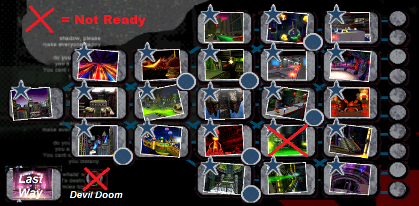

<h1>2 Player Shadow The Hedgehog</h1>

## About
This project aims to get 2 Players working in Shadow The Hedgehog (GameCube)'s 1P modes.

Story Mode, Select Mode, Expert Mode, Last Story.

## Level Status

## Road to 2.0 (WIP) | Release ETA: 9/9/2019
* Fix "Air bug" - (player state pointer overlap issue)
* Space Gadget Gravity Switchers fixed [WIP / POC->Done, further issues identified / DonutStopGaming Task]
* Devil Doom [WIP / DonutStopGaming Task]
* WeaponsTargeting & HomingAttack Other Player Enable/Disable
* Flyables attach to correct player's camera
* Turrets attach to correct player's camera
* Checkpoint Warping/Backtracking separate warping [PARTIAL / Warp Done; Needs UI Control]
* Individual death-to-checkpoint / Don't reload level for both players [PARTIAL / Can be improved]
* Bosses / Worm Enemies / AlienShips should attack closest player
* If P1 is in a Vehicle and P2 attempts to use a CarTypeVehicle, P1 will have control of P2
* **Buffer crash research / possible crash reductions if possible
* -> Verified problematic stages will have TXD reductions [ISSUES FOUND / IN TESTING]
* -> Reductions planned: See `Buffer(s) Issue Identication` section below

#### Completed for 2.0
* Verify 1:1 misc bytes for level edits per HPP v0.7.6+
* Vehicles map to correct player's controlpad and freecam
* Fix "ChaosPowers activate for both players" - add underflow check
* Fix "Disable ScreenShake" - (occasional endless shake issue)
* Partner does not despawn if P1 is not in range of "RW:Range" activation patch for P2
* All bosses are free-cam
* Circus Park Hero Mission counts P2's rings
* GUN Fortress Security Camera segments are free-cam
* Culling issue for P2's screen when near force-fields / or near Vacuum effect (effect removed)
* Key Doors, Westopolis Triggers, Computer Room react to P2
* Android characters have unique JumpBall colors
* Coaster/Pulley/Ziplines fixed

## Buffer(s) Issue Identification

So far three buffers have been confirmed via the PS2 executable :
* GLOBAL
* EVENT
* ETC

Overflowing for the types:

* GLOBAL (Texture) = May crash during play or if level completes successfully RankUI will not draw. After this occurs the game is unstable. Next levels may crash at any time
* AUDIO = Just causes distorted audio while too many sound sources are playing. No adverse effect. Unknown if related to 3 buffers
* EVENT = May crash during EVENT cutscene or after reaching a Goal (after Fade to white on mission completion)
* ETC (Effects) = Same crash type as GLOBAL (Texture)
#### Glyphic Canyon
* Solution: NOT NEEDED
* AUDIO
#### Lethal Highway
* Solution: 32x32 for tile, 1/2 for all other
* GLOBAL (Texture)
#### Circus Park
* Solution: 32x32 for tile, 1/2 for all others
* GLOBAL (Texture)
#### Central City
* Solution: 32x32 DXT1 (XBOX TEX)
* GLOBAL (Texture)
* EVENT (StoryMode Intro & GoalEvent)
#### The Doom
* Solution: 32x32 for non-anim, 1/2 for screens
* ETC (Effects)
#### Sky Troops
* Solution: NOT NEEDED
* AUDIO
#### Lost Impact
* Solution: 32x32 for non-anims, 1/2 for screens, skybox
* GLOBAL (Texture)
* AUDIO
#### GUN Fortress
* Solution: 32x32 stage GDT, reduce textures over 64x64, w Attempt 1 changes
-> Attempt 1 FAILED / Attempted: 32x32, Divide by 2 for same-ratio, reduce textures over 64x64
* GLOBAL (Texture)
* EVENT (GoalEvent)
#### Black Comet
* Solution: 32x32, reduce textures over 64x64
* EVENT (GoalEvent)
#### Cosmic Fall
* Solution : 32x32, half large except earth, and 32x32 GDT
* GLOBAL (Texture)
#### Final Haunt
* Solution: 32x32, reduce textures over 64x64
* EVENT (GoalEvent)
#### Last Way
* Solution: 32x32, reduce textures over 64x64
* GLOBAL (Texture)

## Problems
* Checkpoint Warp Menu only P1 controls Checkpoint UI
* Gravity switches on Space Gadget only alter P1's gravity
* "Air bug" (occasionally P1 or P2 will be stuck in the floating state until hurt when activating a wind tunnel) - Break out with Chaos Blast or move back to the source of the wind
* Turrets alter P1's camera if P2 uses it
* SuperShadow only activates for P1
* If Dark Partner is activated first, P3 remapping fails
* Phase 2 Warp for P2 in Diablon Boss
* Checkpoint Bonus (Rings, Bubble, Lives) are always 10 rings if P2 activates checkpoint
* Worm Enemies and AlienShips will only target P1
* Heavy Dog / Blue Falcon do not damage P2
* Bosses (with the exception of Sonic & Diablon) only react to P1

## Done so far:
* Level chunks load/unload based on both players
* ChaosPowers activate for both players
* Partner/Mission Helpers can be remapped to permanent AI or P3* (P3 has some issues depending on Partner activation order)
* ChaosPowers EventsCamera and ChaosControl Effects removed
* Load P2 in any mode (including camera)
* Enable splitscreen in 1P, disable when in cutscenes/event cameras
* SET objects load/unload based on both players
* Carry over VS mode selected characters into CO-OP mode
* nukkoro2.inf spawn positions for every level
* P2 Sound Listener
* P2 UI
* P2 can pause
* P2's flyables do not overwrite P1's camera
* Vehicles no longer disappear on P2 dismount if P1 is not nearby
* Some segments where a vehicle is required will not have enough distance to cause a respawn (add 2x vehicles)
* Spawners / Worms work properly
* Culling issue for P2's screen when near force-fields / or near Vacuum effect (effect removed)
* Circus Park Hero Mission counts P2's rings
* Partner/Mission Helpers (Sonic, Doom's Eye, Espio, etc...) no longer despawn if P2 activates trigger without P1 being in range
* Vehicles no longer alter P1's camera if P2 uses it; P2 can control CarType Vehicles if mounting while P1 is not driving
* Key Doors, Westopolis Triggers, Computer Room react to P2
* Independent Warping/Backtracking via Checkpoints 
* Coasters / Segments with automated spline sections (e.g. hang-rail in Circus Park) activate on correct player

## Other Known Issues (Not planned to be fixed)
* P2 spawns according to nukkoro2.inf initially fine, but on restart seems to occasionally be off by +-5 - +-20 (stage dependent, game bug)
* Item Bubbles / Hint Bubbles content render based on P1's relative location
* If ChaosPoints are at 0, Dark/Hero orbs only activate P1's ChaosPowers
* Rare instance has been recorded where P1 uses a rocket but the rocket never takes off (state issue?)

## Bonus Roadmap
* Static weapon swaps for Metal Androids
* Optional BlackKnight style melee replacement
* Both players required to reach GoalRing for stage complete

## Dev
* dreamsyntax
* DonutStopGaming

## Credits
* DonutStopGaming for major contributions to chunks, P3/AI partner mapping, CoasterFix, GravitySwitchers, PlayerPointer, structs analysis, and numerous other address discoveries
* LimblessVector for his work on identifying objects, work on the initial memory list, SinglePlayer Widescreen Hack, Stray Pixel under HP Bars fix, 
* TheHatedGravity for red/yellow TrueBlackShadow textures, v1.2+ MenuUI, v2.0 Banner
* Infinite Lives by Link Master
* Chaos Powers Activators by Zzetti
* Original Shadow vector used in banner by nibroc_rock (modified)
* Muzzarino for some symbol findings

## Thanks
* DonutStopGaming for the many nights spent pair reversing and all the contributions to this project
* igorseabra4 and Sewer56 for Heroes and Shadow file reversing work & editing tools (HeroesPowerPlant, HeroesONE-Reloaded, etc...)
* LimblessVector for Shadow file reversing work (HeroesPowerPlant)
* aldelaro5 for Dolphin Memory Engine
* TryTwo for extremely useful new debugging features in Dolphin
* TheHatedGravity, LimblessVector, Shadowth117, DonutStopGaming, my local friends, and all the randoms I played with on Parsec for playtesting
* DeadlyFugu, Muzzarino
* Heroes Hacking Central (&Shadow)